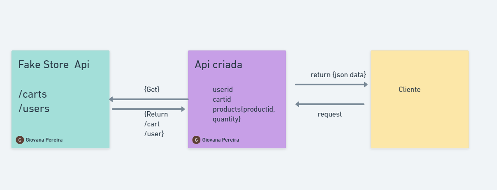

# Desafio arcano



uma aplicação full stack que simula fake store consumindo dados da api fakestoreapi.

##  Tecnologias 

| NextJS  

| Typescript

| Docker

| Jest


## inicialização do projeto

# para as dependências 

```bash

# necessário a instalação do docker 

sudo apt-get remove docker docker-engine docker.io containerd runc

# após termino da instalação insira o comando

docker compose up

```

# comando para inicializar os projeto

```
# para inicar nestjs

npm run start:dev

# para iniciar o teste unitário

npm run test:watch

```


